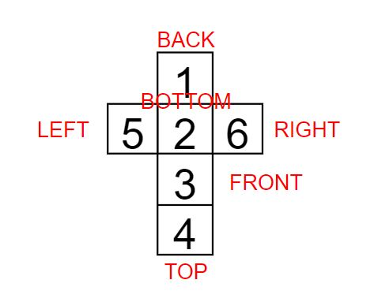
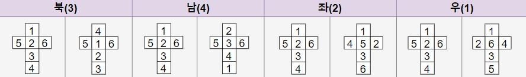

# 주사위 굴리기

> ## 주사위 굴리기
>
> 백준 14499번<br>
> 골드 4
> 문제 링크 : https://www.acmicpc.net/problem/14499

### 주사위

주사위 전개도



문제를 풀면서, 주사위를 모든 방향으로 굴려보고 전개도를 그려 정리하였다.



정리해보면 이동 방향이,

### 북쪽인 경우

    		back = prevTop;
    		bottom = prevBack;
    		front = prevBottom;
    		top = prevFront;

### 남쪽인 경우

    		back = prevBottom;
    		bottom = prevFront;
    		front = prevTop;
    		top = prevBack;

### 왼쪽인 경우

    		top = prevRight;
    		bottom = prevLeft;
    		left = prevTop;
    		right = prevBottom;

### 오른쪽인 경우

    		top = prevLeft;
    		bottom = prevRight;
    		left = prevBottom ;
    		right = prevTop; //나머지 유지

가 된다.
이를 실행한 후 주사위의 밑면만 맵의 칸이 0일 때와 0이 아닌 경우로 업데이트 해주면 된다

### 주사위 밑면

1. 0일 경우 : 주사위 밑면을 맵에 복사한다
2. 0이 아닌 경우 : 칸은 0이 되고, 칸에 있던 숫자가 주사위 밑면이 된다.

## 코드

배열을 사용하여 하면 더 실행 시간이 빠를 수 있겠지만, 틀렸을 경우 디버깅이 좀 더 직관적일 수 있게 static 변수 6개를 두었다.
주사위는 6면 밖에 없기 때문에 문제를 푸는데 복잡해지거나 불편해지지 않았고 가독성 측에서는 더 유리한 것 같다.

```java
public static void main(){
    //입력 코드 생략
		while(!directions.isEmpty()) {
			int dir = directions.poll();
			if(!moveDice(dir))continue;//주사위를 이동시킨다/. if 범위 out : continue -> 프린트 안한다
			//범위에 들 경우-> X,Y좌표 업데이트함
			updateDice(dir);//다이스에 적힌 숫자를 변경한다
			updateMap();//맵에 적힌 숫자와 다이스 밑면의 숫자를 변경한다.
			//System.out.println(top);//맨 위의 숫자를 뿌린다
			bw.write(top+"\n");
		}
		bw.flush();
	}
	static int [] dx = {0,0,0,-1,1}; // 우 좌 상 하
	static int [] dy = {0,1,-1,0,0};

	/**
	 * 다이스를 맵에서 옮긴다 : 해당 방향으로 옮길 수 없다면 false를 리턴 있다면 true를 리턴
	 * @param direction
	 * @param x
	 * @param y
	 * @return
	 */
	public static boolean moveDice(int direction) {
		int nx = X + dx[direction];
		int ny = Y + dy[direction];
		if(nx<0|| ny<0|| nx>=N||ny>=M)return false;
		X = nx;//좌표 업데이트
		Y = ny;
		return true;
	}
	/**
	 * step 1 : update dice
	 * direction 방향으로 다이스를 옮길 때 -> 다이스 면 업데이트
	 * @param direction: 우 1 , 좌 2 , 위 3, 아래 4
	 */
	public static void updateDice(int direction) {
		int prevTop = top, prevBottom = bottom, prevRight = right,
			prevLeft = left, prevFront = front, prevBack = back;//previous 값 저장
		switch (direction) {
		case 1: //우측 이동
			top = prevLeft;
			bottom = prevRight;
			left = prevBottom ;
			right = prevTop; //나머지 유지
			break;
		case 2://왼쪽 이동
			top = prevRight;
			bottom = prevLeft;
			left = prevTop;
			right = prevBottom;
			break;
		case 3: //위로 : 날개유지 한칸씩 밑으로
			back = prevTop;
			bottom = prevBack;
			front = prevBottom;
			top = prevFront;
			break;
		case 4: //아래로 : 날개유지 한칸씩 위로
			back = prevBottom;
			bottom = prevFront;
			front = prevTop;
			top = prevBack;
			break;
		}
	}
	/**
	 * step 2 : check the bottom
	 * 맵의 숫자가 0인 경우		- 주사위 bottom이 칸에 복사된다.
	 * 맵의 숫자가 0이 아닐 경우	- 칸에 쓰여있는 숫자가 주사위의 bottom 이  된다. 칸은 0이 된다
	 */
	public static void updateMap() {
		int landed = map[X][Y];//도착한 숫자
		if(landed ==0 ) { //주사위의 bottom이 복사된다
			map[X][Y]= bottom;
		}
		else {
			map[X][Y] = 0;//칸은 0이 된다
			bottom = landed;//주사위 바닥에 그 칸의 숫자가 복사된다
		}
	}
}
```
